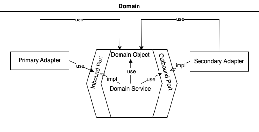
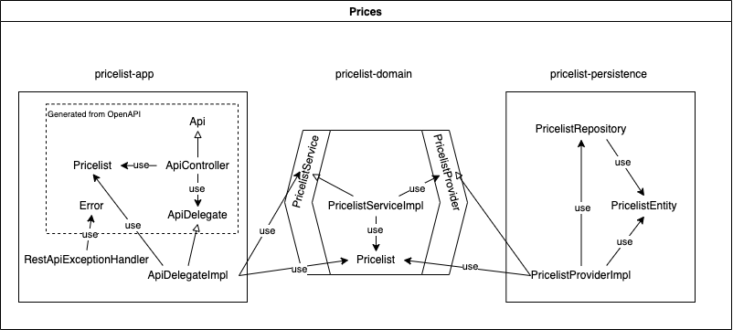

# Prueba Java
## Objetivo
El objetivo de este projecto es dar respuesta al reto propuesto en la [descripción adjunta](#el-problema-propuesto), implementando el software necesario, describiendo las decisiones tomadas tanto arquitectónicas como de implementación, y mostrando posibles alternativas y mejoras a aplicar en posteriores iteracciones de desarrollo.
> ***Nota**: Dado el tamaño del reto propuesto, el diseño realizado podría haber sido más "sencillo". Sin embargo, se ha intentado aplicar buenas prácticas de arquitectura, herramientas de uso común en el desarrollo y, en definitiva, ir un paso más allá de la mera resolución del mismo.*
## Implementación de la prueba
### Arquitectura aplicada
Para la implementación de la prueba se ha utilizado una arquitectura DDD y Hexagonal.   
Partiendo de la definición del dominio (Entidades, ValueObjects y lógica de negocio), se han implementado los "puertos" y "adaptadores" necesarios para permitir la comunicación de ese dominio con el "mundo exterior" (persistencia y API/REST de consulta).  
Para ello, se ha modulado la solución teniendo en cuenta que toda la lógica de negocio resida en el módulo del dominio, poniendo especial cuidado en que dicho módulo no dependa de ningún otro, y dejando los detalles técnicos (frameworks, librerías, canales de comunicación, adaptación de mensajes) en los adaptadores necesarios.
### Diseño
Partiendo de un diseño habitual en una arquitectura hexagonal:  


Se propone una solución con un único dominio (pricelist-domain) y un par de puertos para ofrecer funcionalidades de consulta (pricelist-app) y recuperación de datos (pricelist-persistence)  
Los adaptadores que implementarán estos puertos serán un API/REST y un repositorio de acceso a base de datos JPA.   
* Para el API/REST se utiliza un enfoque API-first, por lo que algunos de los elementos del adaptador vendrán dados a partir de la definición del API (OpenAPI). Para evitar "tocar" los elementos generados, se utilizará un patrón *"delegation"*.   
Para formatear el contenido de los mensajes de error, se utiliza un "[RestControllerAdvice](https://docs.spring.io/spring-framework/docs/current/reference/html/web.html#mvc-ann-controller-advice)" de Spring.   
* Para el acceso a los datos se utiliza un repositorio de spring-data que consultará una entidad de base de datos



> ***Nota**: Existirían, al menos, un par de entidades en la descripción del problema (Brand y Product) que no han sido modeladas por carecer de más información sobre ellas, pero que podrían constituir una agregación con Pricelist.*

### Modulación
A partir del diseño propuesto, se plantea el desarrollo en tres módulos diferenciados (descritos en sus própios ficheros README.md):
* [Módulo de dominio](pricelist-domain/README.md) 
* [Módulo de infraestructura](pricelist-persistence/README.md). Contendrá el adaptador que implementa la persistencia en base de datos SQL
* [Módulo de aplicación](pricelist-app/README.md). Contendrá el adaptador que implementa el API/REST de consulta
### Desarrollo
Para la implementación de la prueba se ha utilizado Java versión 17 (última versión LTS) y el sistema de construcción usado es Maven (última versión)
> ***Nota**: Para evitar la instalación de diversas herramientas en cliente, se puede utilizar un sistema de contenedores para la construcción y realización de pruebas, por lo que sólo sería necesario tener instalado Docker (o alguna otra herramienta similar como podman)*  
*Así, para la construcción de la prueba se realizaría con*
>```console
>docker build -f Dockerfile . -t prueba-java
>```
Se utilizará un projecto maven multi módulo donde se establecerán (y forzarán) las diferentes dependencias entre ellos y con los elementos técnicos (frameworks, librerías, etc.)  
El módulo de dominio (pricelist-domain) no tendrá dependencias externas, forzándolo a través del plugin maven [enforce-plugin](https://maven.apache.org/enforcer/maven-enforcer-plugin/), y el resto (pricelist-app y pricelist-persistence) dependerán de él. 
## Pruebas integradas
Para la comprobación general del desarrollo se realizan pruebas integradas utilizando colecciones [Postman](https://www.postman.com/) que serán automatizadas mediante el uso de la herramienta newman.
Estas pruebas realizarán llamadas API/REST al servicio desarrollado comprobando que el contenido de las respuestas son las esperadas.
La descripción de las pruebas realizadas, así como las instrucciones para su ejecución se pueden encontrar en un [README.md](integration-tests/README.md) específico
## Mejoras implementadas sobre el problema propuesto
En la implementación de la prueba se han aplicado varias mejoras sobre el simple desarrollo y cumplimiento de los puntos a valorar propuestos.
* Se incluyen pruebas unitarias de todos los desarrollos implementados, siguiendo una aproximación TDD
* Se implementan pruebas de integración automatizadas
* La utilización de contenedores en el empaquetado permite la utilización directa del desarrollo en un entorno de orquestación tipo kubernetes
* Se utiliza spring-data y JPA que independiza el desarrollo de la tecnología de base de datos a utilizar.
* Se utiliza una aproximación, para la generación del API/REST, que se inicia desde la definición estándar de su interfaz utilizando **"[Openapi](https://swagger.io/specification/)"* *(API First)*
* La definición de un servidor API/REST tipo MOCK, permitiría el trabajo en paralelo de clientes, antes de la finalización del desarrollo
* La definición y uso de docker-compose permite crear un entorno de desarrollo y/o pruebas sin necesidad de instalar herramientas en entornos locales

## Otras mejoras no implementadas
Auque se ha intentado ir "un paso más allá", aún quedan muchas otras mejoras que podrían aplicarse sobre esta implementación. Entre ellas:
* La inclusión de logs de depuración y/o informacion
* La implementación de algún sistema de autenticación/autorización
* El uso de alguna librería de "mapeo" de atributos entre clases *([mapstruct?](https://mapstruct.org/))* para facilitar el desarrollo y aumentar la legibilidad del código dedicado a este fin.
* El uso de un sistema de cache sobre las consultas realizadas
* La implementación del API utilizando gRPC y protobuf
* ...

Pero los recursos nunca son infinitos...

## El problema propuesto
---
~~~
En la base de datos de comercio electrónico de la compañía disponemos de la tabla PRICES que refleja el precio final (pvp) y la tarifa que aplica a un producto de una cadena entre unas fechas determinadas. A continuación se muestra un ejemplo de la tabla con los campos relevantes:
 
PRICES
-------
 
BRAND_ID         START_DATE                                    END_DATE                        PRICE_LIST                   PRODUCT_ID  PRIORITY                 PRICE           CURR
------------------------------------------------------------------------------------------------------------------------------------------------------------------------------------------------------------------------------------------
1         2020-06-14-00.00.00                        2020-12-31-23.59.59                        1                        35455                0                        35.50            EUR
1         2020-06-14-15.00.00                        2020-06-14-18.30.00                        2                        35455                1                        25.45            EUR
1         2020-06-15-00.00.00                        2020-06-15-11.00.00                        3                        35455                1                        30.50            EUR
1         2020-06-15-16.00.00                        2020-12-31-23.59.59                        4                        35455                1                        38.95            EUR
 
Campos: 
 
BRAND_ID: foreign key de la cadena del grupo (1 = ZARA).
START_DATE , END_DATE: rango de fechas en el que aplica el precio tarifa indicado.
PRICE_LIST: Identificador de la tarifa de precios aplicable.
PRODUCT_ID: Identificador código de producto.
PRIORITY: Desambiguador de aplicación de precios. Si dos tarifas coinciden en un rago de fechas se aplica la de mayor prioridad (mayor valor numérico).
PRICE: precio final de venta.
CURR: iso de la moneda.
 
Se pide:
 
Construir una aplicación/servicio en SpringBoot que provea una end point rest de consulta  tal que:
 
Acepte como parámetros de entrada: fecha de aplicación, identificador de producto, identificador de cadena.
Devuelva como datos de salida: identificador de producto, identificador de cadena, tarifa a aplicar, fechas de aplicación y precio final a aplicar.
 
Se debe utilizar una base de datos en memoria (tipo h2) e inicializar con los datos del ejemplo, (se pueden cambiar el nombre de los campos y añadir otros nuevos si se quiere, elegir el tipo de dato que se considere adecuado para los mismos).
              
Desarrollar unos test al endpoint rest que  validen las siguientes peticiones al servicio con los datos del ejemplo:
                                                                                       
-          Test 1: petición a las 10:00 del día 14 del producto 35455   para la brand 1 (ZARA)
-          Test 2: petición a las 16:00 del día 14 del producto 35455   para la brand 1 (ZARA)
-          Test 3: petición a las 21:00 del día 14 del producto 35455   para la brand 1 (ZARA)
-          Test 4: petición a las 10:00 del día 15 del producto 35455   para la brand 1 (ZARA)
-          Test 5: petición a las 21:00 del día 16 del producto 35455   para la brand 1 (ZARA)
 
 
Se valorará:
 
Diseño y construcción del servicio.
Calidad de Código.
Resultados correctos en los test.
~~~
