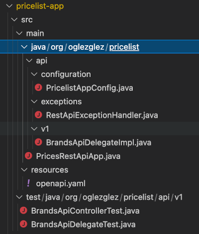
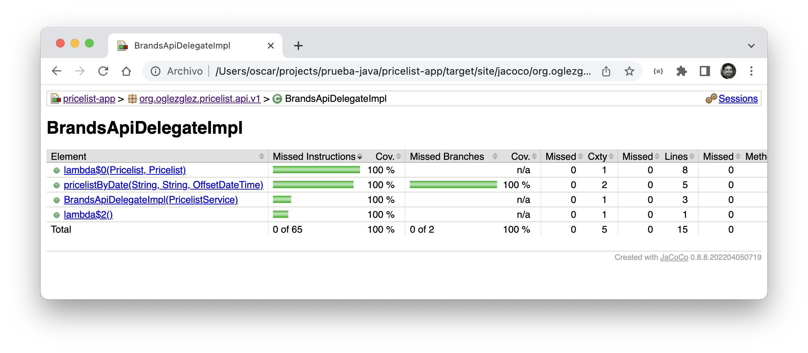

## Módulo de aplicación
En este módulo se desarrolla el adaptador que implementa el "puerto" que ofrece la consulta de tarifas, desarrollada en el módulo de dominio, hacia el exterior en forma de API/REST.

Al tratarse de un adaptador, este módulo si presenta dependencias con la tecnología (framework -> spring-web, modo de API -> REST no reactiva), así como con el módulo de dominio.   
Para la configuración de la infraestructura del framework spring se utiliza una clase de configuración *([PricelistAppConfiguration](src/main/java/org/oglezglez/pricelist/api/configuration/PricelistAppConfig.java))*. En este caso, se crea aquí el "bean" del dominio que será invocado para la consulta de tarifas   
El módulo define el punto de arranque de todo el servicio, por lo que utiliza una clase anotada como aplicación spring *([PricesRestApiApp](src/main/java/org/oglezglez/pricelist/PricesRestApiApp.java))*

Para la implementación del API/REST própiamente dicho, se sigue una aproximación "API-First".   
De esta forma, se parte de la definición del interfaz que va a ofrecer el API/REST *([openapi.yaml](src/main/resources/openapi.yaml))* mediante la especificación *"[Openapi](https://swagger.io/specification/)"* para generar de forma automática el código que implementa dicha defición.   
La herramienta que automatiza esa generación es *"[OpenAPI Generator](https://openapi-generator.tech/)"* que a través de un plugin maven permite tener siempre actualizado el código a partir de la definición   
La definición del API es consultable en tiempo de ejecución utilizando swagger_ui a través de la URL (http://localhost:8080/swagger-ui/index.html)   
Además, esta herramienta permite implementar el API/REST utilizando un patrón *"delegation"*, de forma que lo único que se necesitará codificar es una clase que implemente una interfaz. En ningún momento se modificará el código autogenerado.   

Esta implementación se hace en la clase *([BrandsApiDelegateImpl](src/main/java/org/oglezglez/pricelist/api/v1/BrandsApiDelegateImpl.java))*, cuya principal funcionalidad reside en la transformación de los datos intercambiados entre API y la implmentación del "puerto" *([PricelistService](../pricelist-domain/src/main/java/org/oglezglez/pricelist/service/PricelistService.java))* hacia el dominio

La transformación de los mensajes de error, al formato que la definición del API/REST necesita, se realiza en la clase *([RestApiExceptionHandler](src/main/java/org/oglezglez/pricelist/api/exceptions/RestApiExceptionHandler.java))*

Para probar el API/REST generado, se utiliza una prueba unitaria *([BrandsApiControllerTest](src/test/java/org/oglezglez/pricelist/api/v1/BrandsApiControllerTest.java))* que a través de las facilidades ofrecidas por spring test permite testear las llamadas al API, sin necesitar un servidor web.

Para probar de forma unitaria la transformación de datos *([BrandsApiDelegateTest](src/test/java/org/oglezglez/pricelist/api/v1/BrandsApiDelegateTest.java))*, se utiliza JUnit usando la librería *[Mockito](https://site.mockito.org/)* para sustituir el servicio al que accede.

El objetivo es alcanzar, al menos, un 100% de cobertura del código implementado:
