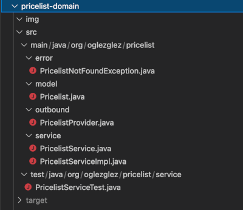
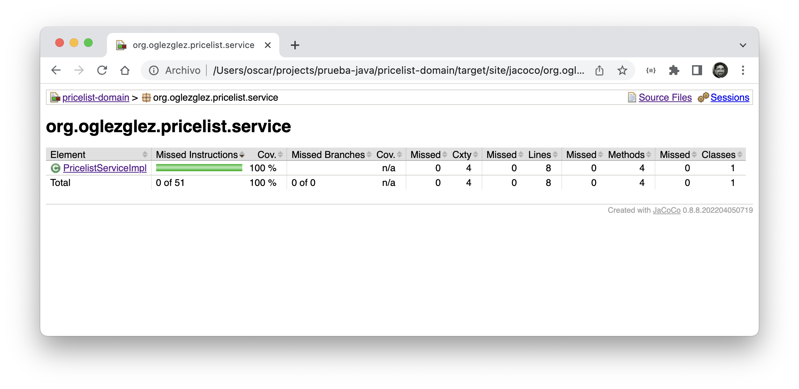

# Modulo del dominio
En este módulo se desarrolla la funcionalidad asociada al dominio mostrado en la descripción de la prueba.   
A partir de esta descripción se ha desarrollado una clase *([Pricelist](src/main/java/org/oglezglez/pricelist/model/Pricelist.java))* que contendrá las propiedades ofrecidas como resultado de la consulta. Esta clase incluirá:
* *brandId*
* *productId*
* *priceFamily*
* *fromDate*
* *toDate*
* *price*
* *curr*
* *priority*

Esta clase será utilizada tanto en la clase que implementa la lógica de negocio, como en los "puertos" que ofrecen dicha lógica al exterior *([PricelistService](src/main/java/org/oglezglez/pricelist/service/PricelistService.java))* y que realizan llamadas al proveedor de datos *([PricelistProvider](src/main/java/org/oglezglez/pricelist/outbound/PricelistProvider.java))*   
La lógica de negocio se implementa en la clase *[PricelistServiceImpl](src/main/java/org/oglezglez/pricelist/service/PricelistServiceImpl.java)* e incluye:
* Se permitirá la búsqueda de tarifas por marca, producto y fecha
* Se devolverá un único elemento de tarifa *([Pricelist](src/main/java/org/oglezglez/pricelist/model/Pricelist.java))* en cada llamada. 
  * Si para los parámetros existieran más de un elemento posible, se seleccionará el de mayor prioridad
  * Si no hay ningún elemento de tarifa se devolverá una excepción *([PricelistNotFoundException](src/main/java/org/oglezglez/pricelist/error/PricelistNotFoundException.java))*
* Se permitirá la búsqueda de tarifas por marca y producto. En este caso, la fecha y hora utilizada será la del momento de la consulta   

Dicha lógica de negocio es ofrecida para ser utilizada a través del interface *([PricelistService](src/main/java/org/oglezglez/pricelist/service/PricelistService.java))* que ofrece los dos métodos de consulta, con y sin fecha   

Para probar de forma unitaria la lógica de negico se utiliza una clase JUnit *([PricelistServiceTest](src/test/java/org/oglezglez/pricelist/service/PricelistServiceTest.java))* usando la librería *[Mockito](https://site.mockito.org/)* para sustituir el proveedor de datos ("puerto") al que accede, e incluye pruebas de:
* Consulta con fecha
* Consulta sin fecha
* Consulta sin resultados
* Consulta con más de un resultado

El objetivo es alcanzar, al menos, un 100% de cobertura del código implementado:
