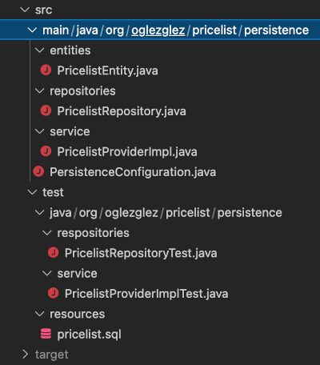
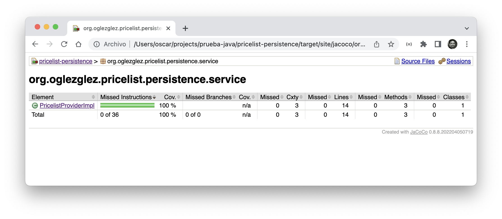

## Módulo de persistencia
En este módulo se desarrolla el adaptador que implementa el "puerto" que provee de tarifas desde una base de datos relacional.

Al tratarse de un adaptador, este módulo si presenta dependencias con la tecnología (framework -> spring-data-jpa, sistema de base de datos -> h2), así como con el módulo de dominio   
Para la configuración de la infraestructura del framework spring, además de la autoconfiguración ofrecida por spring-boot, se utiliza una clase de configuración *([PersistenceConfiguration](src/main/java/org/oglezglez/pricelist/persistence/PersistenceConfiguration.java))*

A partir de la descripción de la prueba, se ha codificado una clase entity *([PricelistEntity](src/main/java/org/oglezglez/pricelist/persistence/entities/PricelistEntity.java))* implementando la tabla descrita *(PRICELIST)* y todos sus campos.

En un interfaz repository *([PricelistRepository](src/main/java/org/oglezglez/pricelist/persistence/repositories/PricelistRepository.java))* se implementa la consulta a la base de datos que recuperará los registros de tarifa pasándole como parámetros: la marca, el producto y una fecha, de forma que los registros devueltos tengan la misma marca y producto pasados como parámetro y una fecha inicio menor o igual y una fecha de fin mayor o igual, que la fecha del parámetro.

La clase *([PricelistProviderImpl](src/main/java/org/oglezglez/pricelist/persistence/service/PricelistProviderImpl.java))* que implementa la interfaz de "puerto" definida en el módulo de dominio, implementará la transformación de los datos recuperados desde la base de datos al formato requerido por dicho interfaz. No implementa lógica de negocio.

Para probar la consulta a bbdd, se utiliza una prueba unitaria *([PricelistRepositoryTest](src/test/java/org/oglezglez/pricelist/persistence/respositories/PricelistRepositoryTest.java))* que a través de las facilidades ofrecidas por spring test, y de la carga de unos datos iniciales *([pricelist.sql](src/test/resources/pricelist.sql))* en una base de datos en memoria, permite testear la consulta, sin necesitar un servidor de BBDD.

Para probar de forma unitaria la transformación de datos *([PricelistProviderImplTest](src/test/java/org/oglezglez/pricelist/persistence/service/PricelistProviderImplTest.java))*, se utiliza JUnit usando la librería *[Mockito](https://site.mockito.org/)* para sustituir el repositorio al que accede.

El objetivo es alcanzar, al menos, un 100% de cobertura del código implementado:
